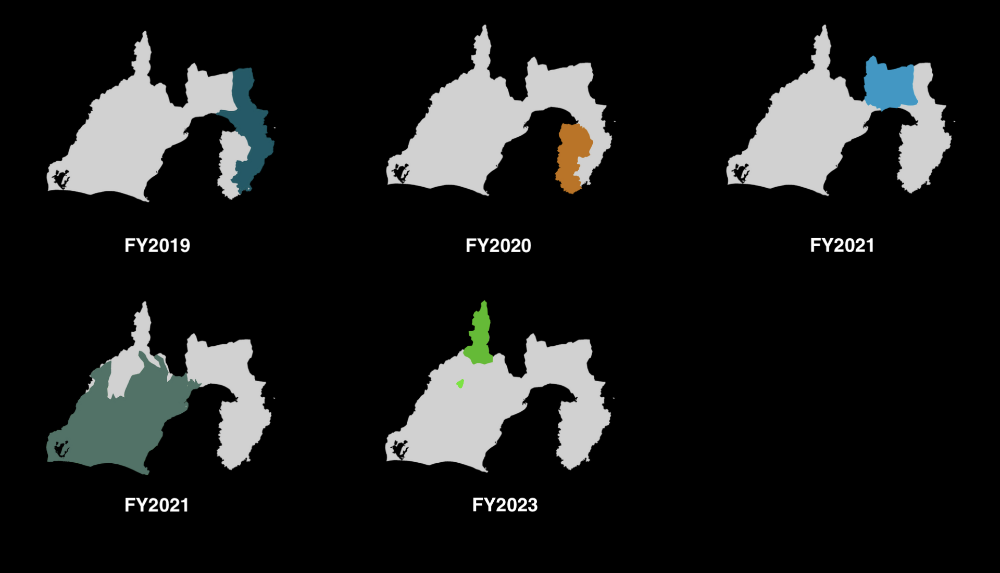
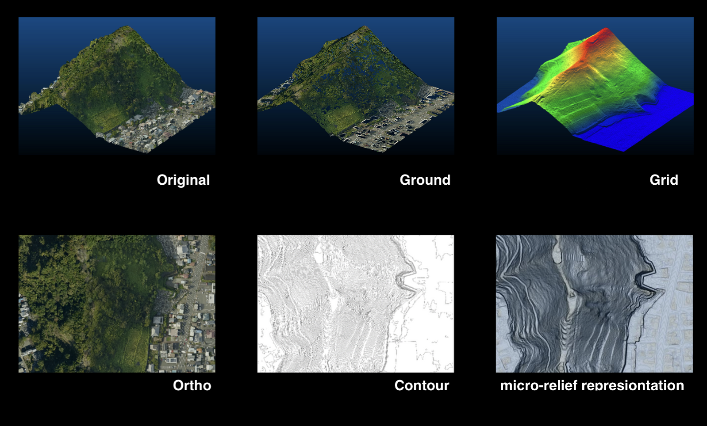

# VIRTUAL SHIZUOKA

## Summary

"VIRTUAL SHIZUOKA" is an initiative to collect and accumulate 3D point cloud data by surveying large areas of real-world space using laser scanners and other tools, with the goal of making this data open to the public.

This data allows for the recreation of Shizuoka Prefecture at a 1:1 scale in a virtual space, represented as a collection of points. It is anticipated to serve as a new form of social infrastructure in the era of digital twins.

Our aim is to use this data not only for urban development, infrastructure maintenance, and disaster prevention, but also for tourism, autonomous driving, entertainment, and other societal applications, to help create a better future for everyone in Shizuoka Prefecture.

## License

[Creative Commons Attribution 4.0 International  (CC-BY 4.0)](https://creativecommons.org/licenses/by/4.0/)

[Open Data Commons Open Database License (ODbL)](https://opendatacommons.org/licenses/odbl/)

## Data

### About

This dataset consists of 3D point cloud data of the entire Shizuoka Prefecture, measured using airborne laser scanning, airborne lasar bathymetry and mobile mapping systems. Each point in the point cloud data contains XYZ coordinates, color information, and class information.

### Coordinate System

[EPSG:6676 (JGD2011 / Japan Plane Rectangular CS VIII)](https://epsg.io/6676)

The Japanese Geodetic System Rectangular Plane Coordinate System is essential for local and regional mapping and surveying in Japan. Its division into zones, combined with the use of the Gauss-Krüger projection, ensures high accuracy in representing geographic positions.

Japan is divided into 19 zones, each with its own local coordinate system. Each zone has a different origin (reference point) from which positions are measured.

In this system, coordinates are expressed as an east-west (x-coordinate) and north-south (y-coordinate) distance from the origin of each zone. This allows for precise identification of locations on a map.

#### References

* [わかりやすい平面直角座標系（国土交通省国土地理院）](https://www.gsi.go.jp/sokuchikijun/jpc.html)
* [State Plane Coordinate System (National Geodetic Survey)](https://geodesy.noaa.gov/SPCS/)

### Grid System

The National Basic Map Grid system is used to divide and identify sections of Japan's National Basic Maps. It's based on the Japan Plane Rectangular Coordinate System, using distances (in meters) from the origin point to define grid sections. It differs from the standard regional mesh system, which uses latitude and longitude for division.

The grid system has five levels of map information: 50000, 5000, 2500, 1000, and 500. Each level has a specific naming convention for its grid sections. The grid code for each map section provides information about its location within the coordinate system.

#### References

- [国土基本図図郭とは｜図郭コードの読み方](https://club.informatix.co.jp/?p=1293)
- [United States National Grid (Federal Geographic Data Committee)](https://www.fgdc.gov/usng/)
- [Using the National Grid (Ordnance Survey)](https://www.ordnancesurvey.co.uk/documents/resources/guide-to-nationalgrid.pdf)

### Format

[LAS](https://www.ogc.org/standard/las/) (compressed by zip/7z)

### Data acquisition area

The acquisition of point cloud data was conducted over multiple years, with each year targeting different areas.

| FY | Area | Directory |
| --- | --- | --- |
| 2019 | Southeast Mt.Fuji and Eastern Izu Peninsula　|   |
| 2020 | Western Izu Peninsula |   |
| 2021 | Mt.Fuji and Eastern Shizuoka |   |
| 2021 | Midwest Shizuoka |   |
| 2023 | Northern Shizuoka and Southern Alps |   |

### Data Types

| Type | Format | Directory Name | Description |
| --- | --- | --- | --- |
| Original | LAS | LP | ??? |
| Ground | LAS | GRD | ??? |
| Grid | ??? | ??? | ??? |
| Ortho | TIFF | ORTHO | ??? |
| Contour | TIFF | CONT | ??? |
| BCK | ??? | BCK | ??? |
| ALB | LAS | ALB | ??? |
| MMS | LAS | MMS | ??? |

### Files

The point cloud data is divided into a large number of files correspondings to each grid of the National Basic Map Grid system, at the level of map information 500. The name of each file contains the grid code.