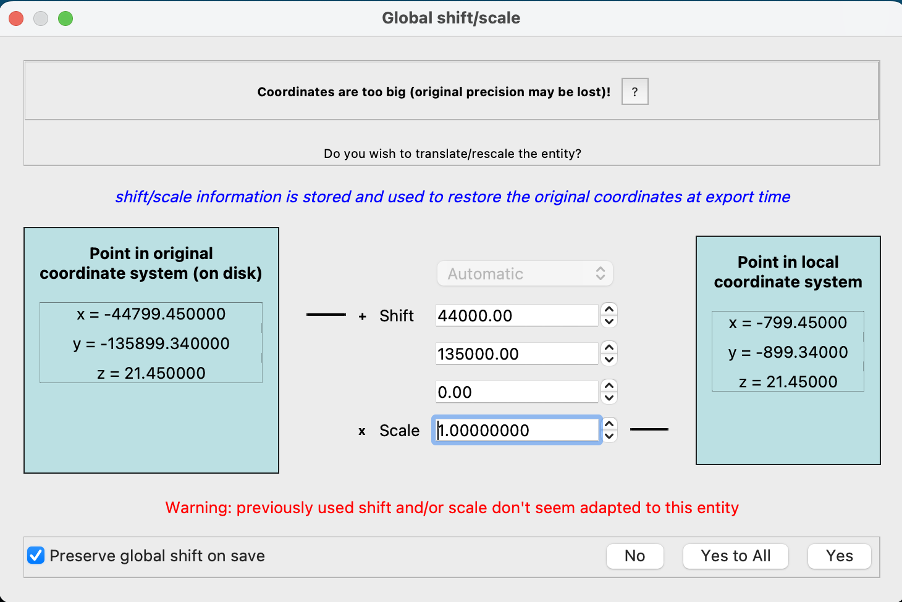
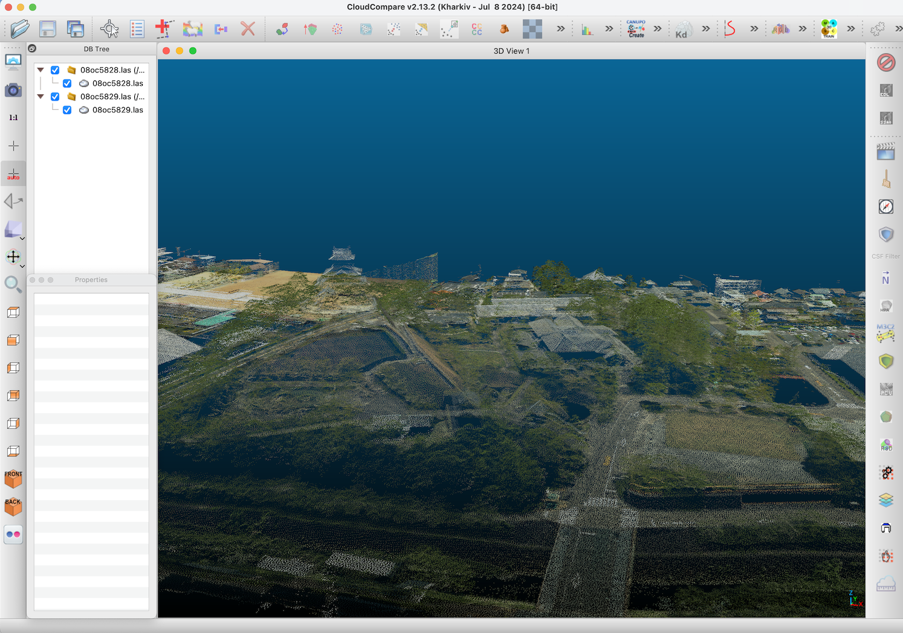

# Tutorials

## Overview

There are various methods for visualizing 3D point cloud data. One option is to use dedicated applications, while another is to leverage web-based libraries for browser visualization.

Popular software for displaying 3D point clouds includes [CloudCompare](https://www.danielgm.net/cc/) and [QGIS](https://qgis.org). For web browsers, libraries like [three.js](https://threejs.org) and [deck.gl](http://deck.gl/) are commonly used.

If you need to perform advanced processing of point cloud data within a program, you can utilize the [PDAL (Point Data Abstraction Library)](https://pdal.io/).

Additionally, point cloud data can be visualized in a browser using a format called [3DTiles](https://cesium.com/why-cesium/3d-tiles/). LAS format data can be converted to 3DTiles for this purpose.

## Application

The las file can be obtained by downloading and extracting the zip file of the point cloud data.

### CloudCompare

CloudCompare allows you to display point cloud data by simply "drag and drop" las files.

When you drag and drop the files, a dialog box "Open LAS file" will appear, so please press the "Apply" button.

Next, a "Global shift/scale" dialog will appear, so please press the "Yes to All" button.

This will display the point cloud data in the window, and you will be able to manipulate it.

The following sample shows the point cloud data of [Kakegawa Castle](https://kakegawajo.com/english/).

The next sample shows the point cloud data of [Shizuoka Stadium](https://www.ecopa.jp/english/).

### QGIS

QGIS also allows you to display point cloud data by simply drag and drop las files. If a dialog for specifying the CRS appears, please select EPSG:6676.

The following sample shows the point cloud data of the summit of [Mt.Fuji](https://www.fujisan-climb.jp/en/index.html).

The next sample shows the point cloud data of Kakegawa Castle.

## Library

### Deck.gl

[Deck.gl](https://deck.gl/) is a framework for visualizing large datasets in web browsers, which supports various type of layers to display geospatial data. [PointCloudLayer](https://deck.gl/docs/api-reference/layers/point-cloud-layer) is enable to visualize point cloud data.

## Tool

### PDAL (Point Data Abstraction Library)

[PDAL](https://pdal.io/) is a C/C++ open source library for translating and manipulating point cloud data, and provides a Python extension.

[Here](https://pdal.io/en/latest/tutorial/index.html) is the official tutorial of PDAL.